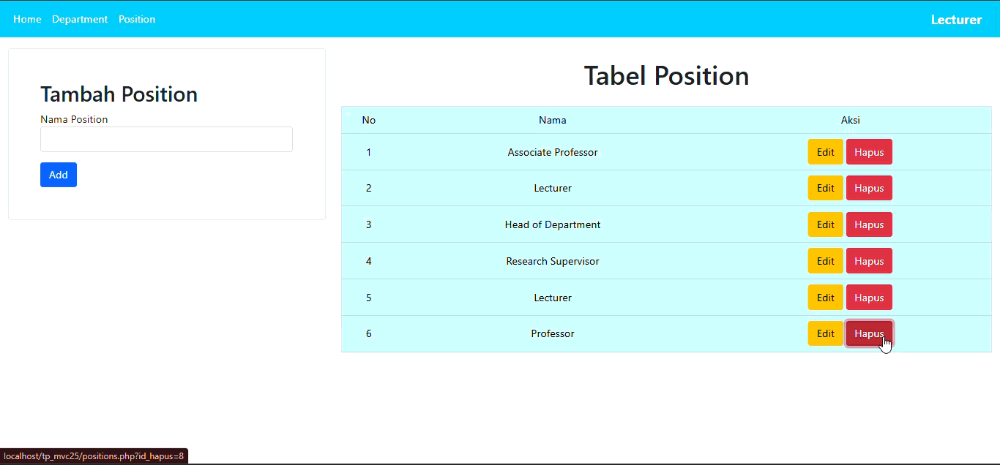

# TP8DPBO2425C1

Saya Hawa Dwiafina Azahra dengan NIM 2400336 mengerjakan Tugas Praktikum 8 dalam mata kuliah Desain dan Pemrograman Berorientasi Objek untuk keberkahanNya maka saya tidak melakukan kecurangan seperti yang telah dispesifikasikan. Aamiin.

## Desain Program

Aplikasi ini dibangun pake arsitektur MVC buat misahin antara logika bisnis, data, dan tampilan. Tujuannya biar kodenya lebih rapi, gampang di-maintain, dan bisa dikembangin lagi nanti.

-   Model: Bagian ini ngurusin semua yang berhubungan sama database.
    -   `DB.php`: Kelas utama buat koneksi ke database.
    -   `Lecturer.php`, `Department.php`, `Position.php`: Kelas-kelas model yang merepresentasikan tabel di database dan berisi fungsi-fungsi buat ngambil atau manipulasi data (SELECT, INSERT, UPDATE, DELETE).
-   View: Bagian ini yang ngurusin tampilan alias user interface (UI).
    -   Isinya file-file PHP yang nampilin data ke pengguna pake HTML. Contohnya `LecturerView.php` buat nampilin daftar dosen, sama `LecturerEditView.php` buat form edit.
-   Controller: Bagian ini jadi jembatan antara Model dan View.
    -   `LecturerController.php`: Nerima input dari pengguna (misalnya dari form), manggil fungsi yang sesuai di Model buat ngolah data, terus nentuin View mana yang harus ditampilin.

## Alur Kerja Aplikasi

kerja aplikasinya secara umum:

1.  Request Masuk: Semua request dari pengguna pertama kali masuk ke `index.php`. File ini bisa dibilang "otak"-nya aplikasi.
2.  Routing Sederhana: `index.php` ngecek parameter di URL (pake `$_GET`) atau data dari form (pake `$_POST`) buat nentuin aksi apa yang diminta pengguna. Misalnya, mau nambah data, edit, atau hapus.
3.  Controller Beraksi: Berdasarkan aksi yang diminta, `index.php` bakal manggil method yang sesuai di `LecturerController`.
4.  Interaksi Model: Controller bakal manggil Model buat ngambil atau nyimpen data ke database. Misalnya, manggil `Lecturer->get()` buat nampilin semua dosen.
5.  Tampilin View: Setelah dapet data dari Model, Controller bakal ngoper data itu ke View yang relevan buat ditampilin ke pengguna dalam format HTML.

## Database

-   Konfigurasi: Semua info koneksi ke database (host, user, password, nama database) disimpen di file `config.php`. Jangan lupa disesuain sama settingan lokalmu.
-   Nama Database: Sesuai di `config.php`, nama databasenya adalah `tp_mvc25`.

## Dokumentasi

### LECTURER

### DEPARTMENT

### POSITION

